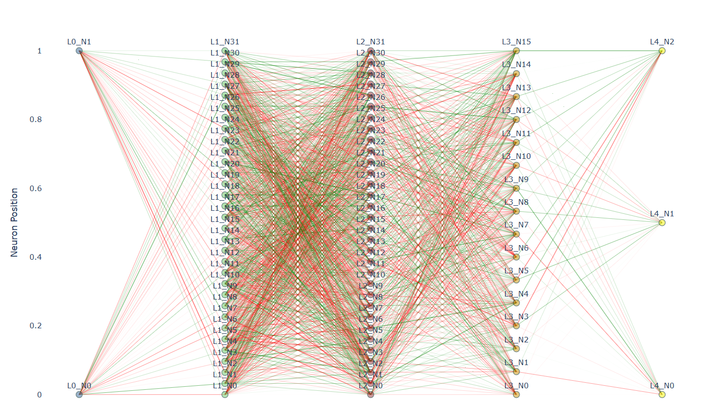

# Neural Network From Scratch

## Overview
This project implements a basic neural network from scratch using NumPy. It includes synthetic data generation, a feedforward neural network with backpropagation, and visualization tools. The network supports gradient descent optimization with ReLU and Softmax activation functions, along with additional features like loss calculation, accuracy evaluation, and dynamic learning rate adjustment.

## Features
- **Synthetic Data Generation**: Generates a spiral dataset for multi-class classification.
- **Fully Connected Neural Network**: Implements dense layers with forward and backward propagation.
- **Activation Functions**:
  - **ReLU**: Rectified Linear Unit for hidden layers.
  - **Softmax**: Activation for the output layer for multi-class classification.
- **Loss Function**: Categorical Cross-Entropy Loss with gradient computation.
- **Training Features**:
  - Backpropagation with gradient descent optimization.
  - Dynamic learning rate decay using exponential decay.
  - Accuracy calculation to monitor model performance.
- **Visualization**: Plotting tools for dataset and training insights.

## Project Structure
```
.
├── docs                    
├── src                     
│   ├── layers              
│   │   ├── dataset.py      # Generates synthetic spiral dataset
│   │   ├── loss.py         # Loss function implementation (e.g., cross-entropy)
│   │   ├── Network.py      # Core neural network implementation
│   │   ├── plot.py         # Visualization utilities for datasets
│   │   ├── softmax.py      # Softmax activation example
│   ├── utils               
│       ├── network_data.json # Sample JSON data for network configurations
│       ├── network_data.py   # Handles network configuration data
│       ├── Visualization.py  # Visualization of neural network structure
│       ├── __init__.py    
├── .gitignore             
├── readme.md               
├── requirements.txt        
```

### Components
#### 1. `layers/dataset.py`
Generates a spiral dataset with customizable parameters:
- Number of classes
- Samples per class
- Random noise for realistic data distribution

#### 2. `layers/Network.py`
Core neural network implementation:
- **Layer_Dense**: Implements fully connected layers.
- **Activation_ReLU**: ReLU activation for non-linearity.
- **Activation_Softmax**: Softmax activation for output classification.
- **Loss_CategoricalCrossEntropy**: Computes loss and gradients.
- **Learning Rate Decay**: Adjusts learning rate dynamically using exponential decay.
- **Accuracy Calculation**: Evaluates model accuracy against true labels.

#### 3. `layers/loss.py`
Handles loss functions such as categorical cross-entropy with gradient computation.

#### 4. `layers/plot.py`
Visualizes the generated spiral dataset using Matplotlib.

#### 5. `layers/softmax.py`
Demonstrates the behavior of the softmax activation function.

#### 6. `utils/network_data.py`
Manages configurations and parameters of the neural network stored in `network_data.json`.

#### 7. `utils/Visualization.py`
Provides an interactive visualization of the neural network structure using Plotly.

## Neural Network Diagram
Below is a placeholder for the neural network diagram. Add your image here:



## Installation
1. Clone the repository:
   ```bash
   git clone https://github.com/your-repo/neural-network-from-scratch.git
   cd neural-network-from-scratch
   ```
2. Install dependencies:
   ```bash
   pip install -r requirements.txt
   ```

## Usage
### 1. Train the Neural Network
Run the `Network.py` script to train the model:
```bash
python src/layers/Network.py
```
This performs the following steps:
1. Generates a synthetic spiral dataset.
2. Initializes the neural network with two dense layers.
3. Trains the model for a specified number of epochs.
4. Displays the following outputs:
   - Softmax probabilities for the first 5 samples.
   - Final loss value.
   - Model accuracy.

### 2. Visualize the Dataset
To visualize the synthetic dataset:
```bash
python src/layers/plot.py
```

### 3. Visualize the Neural Network Structure
To generate an interactive visualization of the neural network architecture:
```bash
python src/utils/Visualization.py
```
This will create an interactive HTML file showing the network's layers, nodes, and connections.

## Recent Updates
### 1. Dynamic Learning Rate Decay
- Implements exponential learning rate decay during training.

### 2. Categorical Cross-Entropy Loss
- Full forward and backward implementation for gradient computation.

### 3. Accuracy Calculation
- Adds accuracy evaluation by comparing predictions to true labels.

### 4. Interactive Neural Network Visualization
- Introduces Plotly-based visualization to display the network architecture dynamically.

### 5. Stochastic Gradient Descent
- Incorporates stochastic gradient descent as an optimization technique during training.

## Work in Progress
Planned enhancements include:
- Advanced optimizers (e.g., Adam, RMSProp)
- Additional activation functions (e.g., Tanh, Sigmoid)
- Model evaluation metrics (e.g., precision, recall, F1-score)
- Saving and loading trained models
- Integration of batch processing
- Comprehensive testing suite

## Example Output
When training the network, sample output includes:
```
...
Softmax probabilities for first 5 samples:
[[0.05, 0.90, 0.05], [0.10, 0.80, 0.10], ...]
Final Loss: 0.3452
Final Accuracy: 92.0%
```

## Dependencies
- NumPy
- Matplotlib
- Plotly

Install them via:
```bash
pip install numpy matplotlib plotly
```

## Contributing
We welcome contributions to improve this project! To contribute:
1. Fork the repository.
2. Create a feature branch:
   ```bash
   git checkout -b feature/your-feature-name
   ```
3. Commit your changes and submit a pull request.
4. Ensure your code is well-documented and tested.

For more details, refer to [CONTRIBUTING.md](CONTRIBUTING.md).

## License
This project is licensed under the MIT License. See the [LICENSE](LICENSE) file for more details.

---

Happy Coding! 🚀

